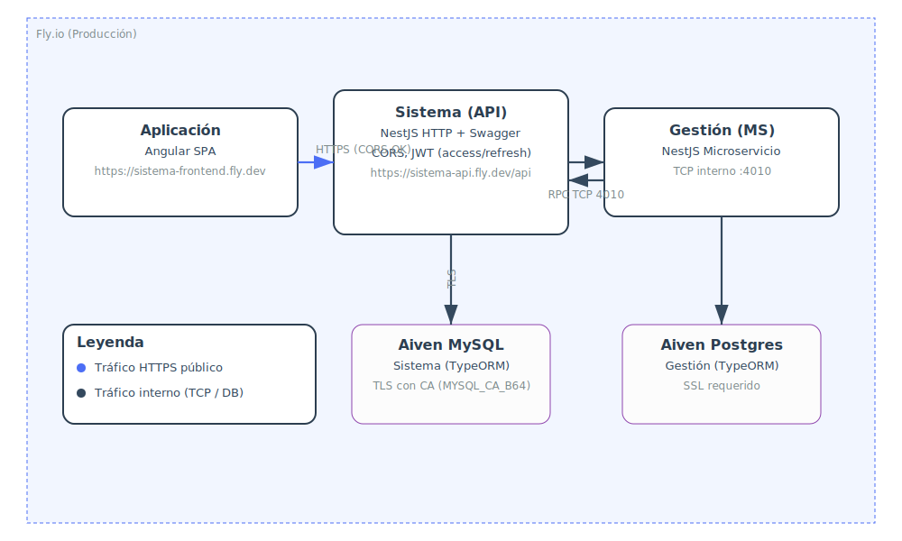

# Microservicio Principal - Sistema de Gestión

Este es el microservicio principal del sistema de gestión empresarial, desarrollado con NestJS siguiendo arquitectura DDD (Domain-Driven Design). Se encarga de la gestión de usuarios, autenticación, autorización y coordinación con otros microservicios.

## Características

- **Arquitectura DDD**: Separación clara entre dominio, aplicación, infraestructura y presentación
- **Autenticación JWT**: Tokens de acceso y refresh tokens
- **Autorización basada en roles**: Administrador, Supervisor, Tecnico, Cliente
- **Base de datos MySQL**: Con Docker y TypeORM
- **Documentación Swagger**: API completamente documentada
- **Encriptación segura**: bcrypt para contraseñas
- **Manejo de errores robusto**: Filtros globales de excepciones
- **Transacciones**: Soporte para operaciones atómicas
- **Endpoint público**: Registro de clientes sin autenticación

## Prerequisitos

- Node.js (v18 o superior)
- Docker y Docker Compose
- Git

### Iniciar la base de datos MySQL

```bash
docker-compose up -d
```

### 3. Iniciar la aplicación

```bash
npm run start:dev
```

## Arquitectura



La SPA de Angular (Aplicación) consume el API de Sistema por HTTPS con CORS habilitado. El servicio Sistema se comunica por RPC TCP con el microservicio de Gestión. Cada servicio persiste en su propia base de datos administrada (Aiven MySQL para Sistema y Aiven Postgres para Gestión), ambas con conexión segura (SSL/TLS).

## Documentación

- **API Documentation**: Disponible en `http://localhost:3000/api/docs` (Swagger)
- **Arquitectura DDD**: El proyecto sigue principios de Domain-Driven Design
- **Autenticación JWT**: Sistema de tokens para autenticación y autorización
